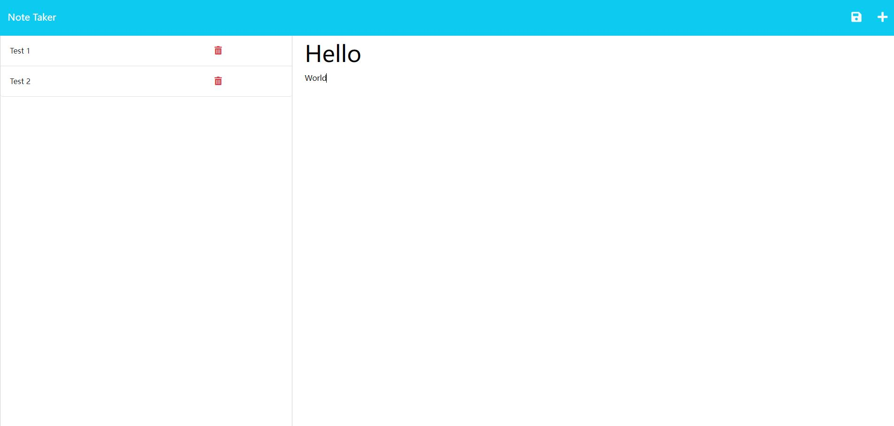

  # Note-Taking-Application

  ## Description:
  ### This application allow user to add, view and delete notes, using `fs`, `express.js`, `path` and deployed on Heroku.

  ## Table of Content
  ### *[Installation](#installation)
  ### *[Usage](#usage)
  ### *[Credits](#credits)
  ### *[License](#license)
  ### *[Features](#features)
  ### *[Contributors](#contributors)
  ### *[Tests](#tests)

  ## Installation:
  ### N/A

  ## Usage:
  ### To use this application, click "Get Started" in the home page:  then user can add notes by clicking the "+" on the top right cornor, then click the save symbol beside the "+" sign to save the notes:  To view the saved notes just click the notes on the left hand side, click the delete symbol to delete certain note.

  ## Credits:
  ### The front end code are cloned from: https://github.com/coding-boot-camp/miniature-eureka.

  ## License: MIT 
  ### https://opensource.org/licenses/MIT

  ## Features:
  ### This application allow user to add, view and delete notes.

  ## Contributors:
  ### N/A

  ## Tests:
  ### N/A

  ## Questions:
  ### Github: https://github.com/Haozhe-H/Note-taking-application
  ### Email: N/A
